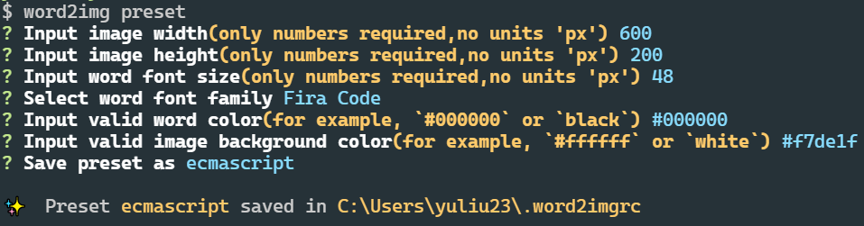

# word2img-cli
一个命令行工具，接收用户输入，生成一张由输入的单词和参数生成的图片，存储在用户的硬盘上

# 安装

推荐全局安装

```sh
npm install -g word2img-cli
```

# 使用方式

## `word2img new`命令

最简单的使用方式，就是`new`命令后跟一个单词或词组，如果词组中间有空格需要用单引号或双引号包裹起来

```sh
word2img new 'hello world'
```

比如上面的命令会在命令行运行的目录下生成一张图片

```sh
$ word2img new 'hello world'
✨ image generated successfully at: E:\niko\word2img_1646633828358.png
```


当然，你还可以传入额外的参数，参数及默认值枚举如下：

| 参数 | 参数简写 | 含义 | 默认值 | 备注 |
| - | - | - | - | - |
| --preset | -p | 预设值 | 无 | 无 |
| --width | -w | 图片宽度(px) | 600 | 无 |
| --height | 无 | 图片高度(px) | 200 | 无 |
| --bgColor | 无 | 图片背景色(十六进制颜色值) | '#fff' | 无 |
| --color | 无 | 文字颜色值(十六进制颜色值) | '#000' | 无 |
| --size | 无 | 文字字体大小(px) | 48 | 无 |
| --family | 无 | 文字字体 | 'Arial' | 可选值: 'Arial', 'Sans', 'Avenir', 'Helvetica', 'Fira Code' |
| --filename | 无 | 文件名称(px) | `word2img_${Date.now()}.png` | 文件名，需要包含扩展名，目前仅支持了一个固定字符串，没做pattern支持以及变量占位符等 |
| --filepath | 无 | 图片保存在你硬盘上的路径 | process.cwd() | 路径需要是绝对路径，并且不包含文件名 |

比如，下面的命令表示在**E盘**下生成一张名为**hello.jpg**的图片，我们为这张图片设置了字体颜色为**红色**，其余参数采用默认参数

```sh
word2img new --color '#f00' --filepath '/e' --filename 'hello.jpg' 'hello'
```

```sh
$ word2img new --color '#f00' --filepath '/e' --filename 'hello.jpg' 'hello'
✨ image generated successfully at: E:\hello.jpg
```


## `word2img preset`命令

每次都输入很多参数很麻烦，如果你想经常使用一组相同的参数只是要生成图片的单词不同，那么你可以把一组特定的参数保存为一个预设，下次使用`new`命令时，只需要带上你需要的预设参数`--preset`或`-p`即可

比如我们使用`word2img preset`来生成一个预设，交互式命令行会询问你一系列参数，有输入和选择等操作，回车就会采用默认值



上面的命令输出就生成了一个名为`ecmascript`的预设，这个预设保存在你的家目录中一个名为`.word2imgrc`的文件中：

```json
{
  "presets": {
    "ecmascript": {
      "width": 600,
      "height": 200,
      "size": 48,
      "family": "Fira Code",
      "color": "#000000",
      "bgColor": "#f7de1f",
      "saveName": "ecmascript"
    }
  }
}
```

有了这个预设，你下次使用`new`命令就只需要输入一个预设参数代替输入这一系列参数了：

```sh
word2img new -p ecmascript 'hello world'
```


# 另外的话

这个项目是当时为了学习node命令行写的，写的过程去读了`@vue/cli`的源码，比如预设那块文件保存在`.word2imgrc`就借鉴了其思路。代码很糙，而且功能也很简单，还有很多可以优化的点，比如：

- 现在`new`命令只支持了英文字符
- 考虑支持更多字体
- 考虑保存文件的路径和文件名支持pattern
- 考虑支持查看预设列表和查看预设详情的功能
- ...

这些先占坑吧，感觉如果把功能完善一下还能是个挺好玩的工具的。

另外，当时在掘金上也写了一篇相关的[博客](https://juejin.cn/post/6948330334085709855)