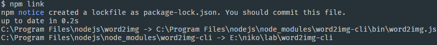
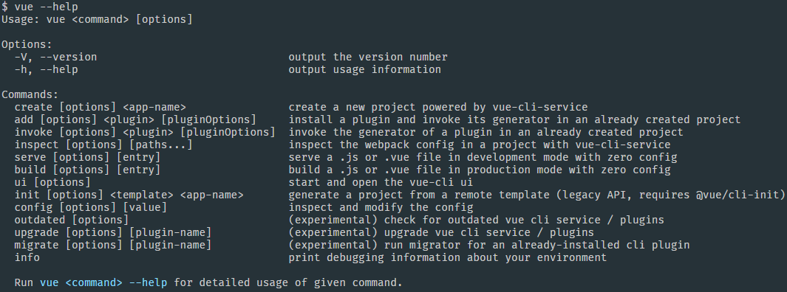

# 缘起


摸鱼的时候经常能看到有些文章的开头会放一张纯色背景搭配一个单词的图片，用来大致说明这篇文章的主题，就像上面这样。我就想这样简单的图片是不是可以通过一些工具来快捷的生成呢？我知道canvas可以快捷的绘制文本并且生成图片，需求很好实现。那么通过什么工具承载呢？命令行似乎是个不错的选择，接收用户输入的单词，通过一些额外的参数来控制图片样式，生成图片后下载到用户的硬盘上。一番实践后发现效果还不错，于是就有了这篇文章，详细地说明下如何从零开始编写一个Node命令行工具。

# 初始化

初始化项目

```sh
mkdir word2img-cli
cd word2img-cli
npm init
```

package.json需要做一些改动，删除`main`和`scripts`字段，因为用不到，增加`bin`字段，用于指定可执行文件路径。这里用到了markdown的文件的diff代码高亮，用于标记文件改动，接下来通篇涉及到文件diff的地方都会使用此方法。

```diff
  {
    "name": "word2img-cli",
    "version": "0.0.1",
    "description": "command line interface for generate image based on your input",
-   "main": "index.js",
-   "scripts": {
-     "test": "echo \"Error: no test specified\" && exit 1"
-   },
+   "bin": {
+     "word2img": "bin/word2img.js"
+   }
  }
```

新建`bin/word2img.js`文件，输入如下内容

```diff
#!/usr/bin/env node

console.log('hello world')
```

现在在命令行输入`./bin/word2img.js`，已经可以看到正常的输出了


但是现在需要输入文件的相对路径，这个不酷，我们来把相对路径去掉，命令行输入`npm link`



此时直接在命令行输入命令`word2img`，也可以得到和刚才一样的输出了，不错，可以不用写路径直接输入命令了，有内味了。


到这里，需要解释下上面引入的几个概念

## package.json的bin字段

bin字段用于映射可执行文件的路径，作用类似于添加环境变量，参考[官方文档](https://docs.npmjs.com/cli/v7/configuring-npm/package-json#bin)

## 文件开头的`#!/usr/bin/env node`

用来向系统指明这个文件的解释器是node，参考[Shebang](https://en.wikipedia.org/wiki/Shebang_(Unix))

## npm link

从上面贴的`npm link`执行输出的截图可以看到，就是进行了一个软链的过程，把当前项目软链到nodejs安装目录的node_modules文件夹下的同名文件夹，然后再软链到nodejs安装目录下的同名可执行文件。

以我当前项目为例，我使用的是windows系统，打开`C:\Program Files\nodejs\`文件夹，可以看到多了两个文件`word2img`和`word2img.cmd`，这两个文件都可以用编辑器打开，这里就不贴了，有兴趣可以自己操作下。同时`C:\Program Files\nodejs\node_modules\`文件夹下多了一个`word2img-cli`的软连接文件夹，内容和我们的项目一样。

执行完这个命令后就可以全局使用我们的命令了，`npm link`还可以指定项目使用，这里就不展开了，要了解详细用法还是参考[官方文档](https://docs.npmjs.com/cli/v7/commands/npm-link)。

# 初探commander和chalk

现在我们的命令行只能直接敲个命令，输出一个`hello world`，好像完全没有什么卵用。让我们来回顾下常见命令行都有哪些玩法吧，以常用的`@vue/cli`为例：

```sh
# 查看当前版本
vue -V # 或 vue --version

# 查看使用说明
vue -h # 或 vue --help

# 新建项目
vue create vue-demo

# 通过option指定使用某个preset新建项目
vue create -p vue3 vue3-demo

# 添加eslint插件
vue add eslint

# 添加eslint插件，并指定插件options
vue add eslint --config airbnb --lintOn save
```

有最常见的查看版本和查看使用说明功能，这个是比较通用的功能。同时`vue create vue-demo`里的`create`是命令(command)，`vue-demo`是命令的值。而`vue create -p vue3 vue3-demo`里的`-p`则是选项(option)，`vue3`则是选项`p`的值。

还可以通过不同的位置来指定不同的选项，比如上面`vue add eslint --config airbnb --lintOn save`里的`--config airbnb --lintOn save`是传递给`eslint`这个插件的选项`pluginOptions`。输入`vue -h`看到`vue add [options] <plugin> [pluginOptions]`也可以验证这一点。



上图最后一句`Run vue <command> --help for detailed usage of given command.`，意思是每一个命令后跟option`--help`还可以查看这个命令的使用说明，以`vue create`为例：


## commander

接下来，开始实现这些类似的效果。我们用原生nodejs也可以处理命令行参数，但是比较麻烦，`[commander](https://www.npmjs.com/package/commander)`是一个成熟的解决方案。

```sh
npm install --save commander
```

修改`./bin/word2img.js`文件：

```diff
  #!/usr/bin/env node

- console.log('hello world')
+ const program = require('commander')
+ program.version(require('../package').version).usage('<command> [options]')
+ program.parse(process.argv)
```

此时，分别输入`word2img -V`(这里是大写，或者`--version`)和`-h`(或者`--help`)，可以看到查看版本和查看使用说明功能已经完成了。对比下下面的贴图和上面`vue`命令的贴图，已经很接近了，这些都是`commander`帮我们完成的，而这仅仅需要三行代码，代码很简单就不展开解释了。


## chalk

回到上面`vue --help`的输出贴图，最后一句`Run vue <command> --help for detailed usage of given command.`里`vue <command> --help`一句的颜色是青色的。对命令行的输出进行着色，我们可以使用[chalk](https://www.npmjs.com/package/chalk)

```sh
npm install --save chalk
```

修改`./bin/word2img.js`文件：

```diff
  #!/usr/bin/env node

  const program = require('commander')
+ const chalk = require('chalk')
+ 
  program.version(require('../package').version).usage('<command> [options]')
+ 
+ program.on('--help', () => {
+   console.log()
+   console.log(
+     `  Run ${chalk.cyan(
+       `word2img <command> --help`
+     )} for detailed usage of given command.`
+   )
+   console.log()
+ })
+ 
  program.parse(process.argv)
```

此时，命令行输入`word2img -h`，已经能看到带颜色的输出了


可以看到`chalk`的用法很简单，它提供了很多内置颜色，要了解更消息的用法可以查看官网。

# 定义第一个命令

回过头来看下文章的第一张图片，如果我们的需求就是接收用户输入的字符串，把它转化成一张纯色背景文字居中的图片，那么我们可以大致确定出我们需要的来自外部的变量有这些：

- word(将要被转化成图片的字符串)
- width(图片的宽度)
- height(图片的高度)
- bgColor(图片的背景颜色)
- color(文字的颜色)
- size(文字的大小font-size)
- family(文字的字体font-family)
- filename(要下载的图片的文件名)
- filepath(图片保存的路径)

其中word是命令本身的值，其它的都是选项，先不考虑canvas绘制图片的业务代码部分，仅考虑接收上面提到的这些变量，那我们可以写出如下的代码，修改`./bin/word2img.js`：

```diff
// program.version及上面的代码省略
// program.version(...)

+ program
+   .command('new <word>')
+   .description('generate a new image use the input word')
+   .option('-w --width <width>', 'Set width of the image', 600)
+   .option('--height <height>', 'Set geight of the image', 200)
+   .option('--bgColor <bgColor>', 'Set backgound-color of the image', '#fff')
+   .option('--color <color>', 'Set color of the word', '#000')
+   .option('--size <size>', 'Set font-size of the word', 48)
+   .option('--family <family>', 'Set font-family of the word', 'Arial')
+   .option('--filename <filename>', 'Set filename of the image')
+   .option('--filepath <filepath>', 'Set file path to save the image(note that the path doesn\'t contain the file name)', process.cwd())
+   .action((word, options) => {
+     console.log(word, options)
+     // canvas绘制并生成图片...
+   })

// program.on及以下的代码省略
// program.on(...)
```

命令行输入`word2img new 'hello world'`，可以得到如下输出：


解释下上面的代码和输出：首先`program.command`方法接收一个字符串`new <word>`，这就定义了一个命令，其中`new`就是命令的名称，`<word>`指代这个命令的值。紧接着`description`方法接收一个字符串用来简要描述这个命令的作用。

下面跟了多个串行的`option`方法，定义命令的选项，正好和我们上面说的变量一一对应。这个方法的第一个参数和命令类似，定义选项名称（注意选项一个横杠`-w`代表简写但是只能跟一个字母，两个横杠`--width`后面不限制字符长度）。第二个参数是一个用来描述这个选项作用的字符串。如果你想为这个选项提供一个默认值，则可以通过第三个选项指定。

最后通过`action`方法来监听用户输入，当用户输入`new`命令后会触发回调函数，回调函数的第一个参数是命令的值，第二个参数是上面的选项对象，从上面的输出截图也可以看到这两个值。后续的具体业务代码就可以在这个回调函数里补充了。

# 实现canvas相关业务代码

本文的重点其实是命令行相关知识，所以业务代码就不做详细说明了，直接上代码：

```sh
npm install --save canvas
```

新建`./utils/newCanvas.js`，内容如下：

```javascript
const { createCanvas } = require('canvas')

exports.newCanvas = function (word, options) {
  const canvas = createCanvas(options.width, options.height)
  const ctx = canvas.getContext('2d')

  // rect
  ctx.fillStyle = options.bgColor
  ctx.fillRect(0, 0, options.width, options.height)
  // word
  ctx.textBaseline = 'middle'
  ctx.textAlign = 'center'
  ctx.font = `${options.size}px ${options.family}`
  ctx.fillStyle = options.color
  ctx.fillText(word, options.width / 2, options.height / 2)

  return {
    canvas,
    ctx,
  }
}
```

新建`./utils/canvas2img.js`，内容如下：

```javascript
const fs = require('fs')
const path = require('path')
const chalk = require('chalk')

exports.canvas2img = function (canvas, filename, filepath) {
  const buf = canvas.toBuffer()
  filename = filename || `word2img_${Date.now()}.png`
  const url = path.resolve(filepath, filename)
  fs.writeFile(url, buf, function (err) {
    if (err) {
      console.log(err)
    } else {
      console.log(
        `✨ image generated successfully at: ${chalk.yellow(
          url
        )}`
      )
    }
  })
}
```

`./bin/word2img.js`文件内容修改如下：

```diff
  #!/usr/bin/env node
  
  const program = require('commander')
  const chalk = require('chalk')
+ const { newCanvas } = require('../utils/newCanvas')
+ const { canvas2img } = require('../utils/canvas2img')
  
  program.version(require('../package').version).usage('<command> [options]')
  
  program
    .command('new <word>')
    .description('generate a new image use the input word')
    .option('-w --width <width>', 'Set width of the image', 600)
    .option('--height <height>', 'Set geight of the image', 200)
    .option('--bgColor <bgColor>', 'Set backgound-color of the image', '#fff')
    .option('--color <color>', 'Set color of the word', '#000')
    .option('--size <size>', 'Set font-size of the word', 48)
    .option('--family <family>', 'Set font-family of the word', 'Arial')
    .option('--filename <filename>', 'Set filename of the image')
    .option('--filepath <filepath>', 'Set file path to save the image(note that the path doesn\'t contain the file name)', process.cwd())
    .action((word, options) => {
-     console.log(word)
-     console.log(options)
+     const { canvas } = newCanvas(word, options)
+     canvas2img(canvas, options.filename, options.filepath)
    })
  
  program.on('--help', () => {
    console.log()
    console.log(
      `  Run ${chalk.cyan(
        `word2img <command> --help`
      )} for detailed usage of given command.`
    )
    console.log()
  })
  
  program.parse(process.argv)
```

此时，命令行输入`word2img new 'hello-word'`,成功在项目根目录生成了图片，并且终端会提示文件的位置信息。当然，也可以传递上面列举的不同的选项，这里就不一一列举了。


至此，一个简单的命令行就完成了，基本实现了文章开头的需求。实际上还有很多可以优化的地方，比如可以通过命令行提问让用户输入答案或选择答案的方式来简化冗长的选项输入，提升用户体验，熟悉`@vue/cli`的小伙伴对此应该不会感到陌生。限于篇幅以及代码复杂度，这部分就不在文章里介绍了，有兴趣的可以查看[项目源码](https://github.com/nikolausliu/word2img-cli)，或者直接看`@vue/cli`的源码，我在写这个项目之前就看了`@vue/cli`的源码，得到了很多帮助。

# 发布npm包

到[npm官网](https://www.npmjs.com/)注册个账号，然后命令行`npm login`输入用户名密码登录一下，登录成功后`npm whoami`可以看到自己的用户名：

```sh
npm login
npm whoami
```

如果npm使用了淘宝源需要切换到官方源，建议使用nrm管理npm源

```sh
npm install -g nrm
nrm ls
nrm use npm
```

然后发布，如果发布提示403，可能是包重名了或者邮件没认证，到邮件里点下认证就好了

```sh
npm publish
```

npm发布成功后，到官网搜索`word2img-cli`就可以看到我们的包了。

